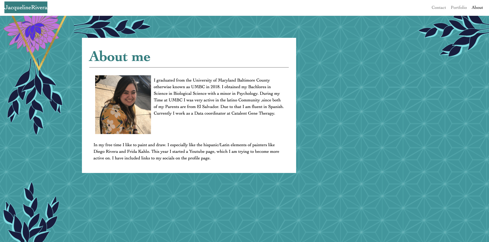
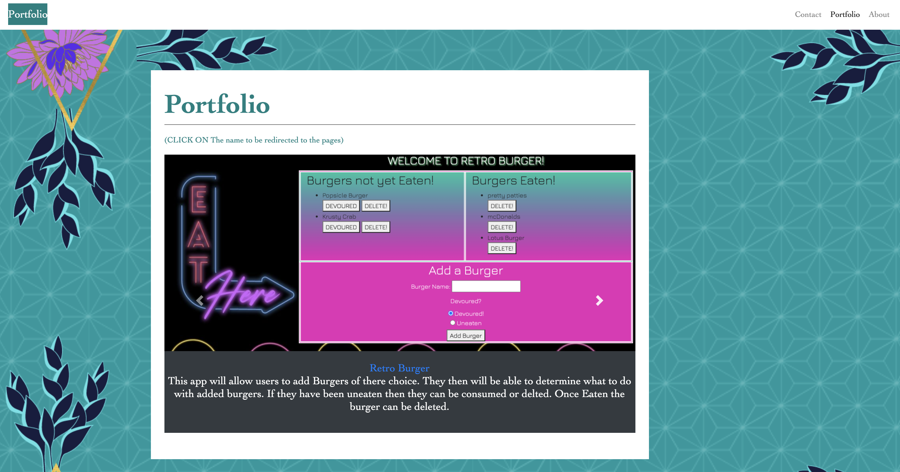
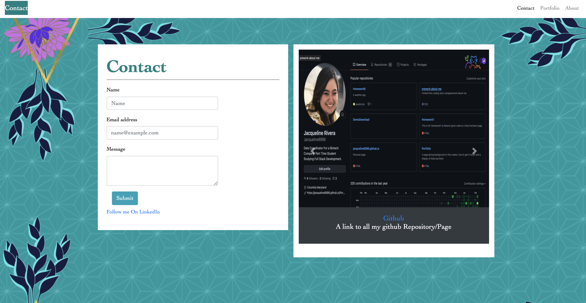

# Summary:
  This page will be used to learn more information on the developer. 
  After Viewing the page the following will be know:
*   Who is the developer as well as their image via the About Tab.
*   A way to leave your  contact information so the developer may reach out via the Contact Tab. 
*   As well as current projects they are working on via the Portfolio Tab. 

 
# Usage:
 The page will be viewable on desktop as well as mobile device. The user will not need to perform any changes to the page, it will occur automatically. 

 
# Installation:
  There is no installation required for this page, all files can be viewed at the following link:
* GitHUB Repo : https://github.com/Jacqueline8996/Portfolio
* Live Link: https://jacqueline8996.github.io/Portfolio/

# Page Images 
* Images of the home page of the link 

* Resources on Me will be located here 

* Contact information can be delivered 

# Future developement : 
*  Figuring out how to get user input to keep them updated. 
